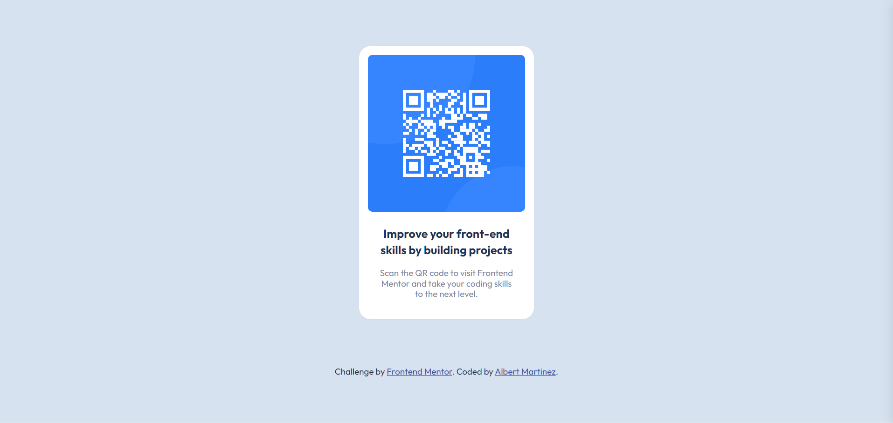

# Frontend Mentor - QR code component solution

This is a solution to the [QR code component challenge on Frontend Mentor](https://www.frontendmentor.io/challenges/qr-code-component-iux_sIO_H). Frontend Mentor challenges help you improve your coding skills by building realistic projects.

## Table of contents

-  [Overview](#overview)
   -  [Screenshot](#screenshot)
   -  [Links](#links)
-  [My process](#my-process)
   -  [Built with](#built-with)
   -  [Useful resources](#useful-resources)
-  [Author](#author)

## Overview

### Screenshot

### Links

-  Solution URL: [Add solution URL here](https://your-solution-url.com)
-  Live Site URL: [Add live site URL here](https://your-live-site-url.com)

## My process

### Built with

-  Semantic HTML5 markup
-  BEM
-  Flexbox
-  Mobile-first workflow

### Useful resources

-  [Quick start with BEM Methodology](https://www.example.com) - New to using BEM, this resources provides the right amount of simplicity and easy to digest bits of information that allows me to learn quickly and easily. Full of little code snippets to help understand complex concepts for visual learners like myself.

## Author

-  Website - [Albert Martinez](https://github.com/ialbertmartinez)
-  Frontend Mentor - [@ialbertmartinez](https://www.frontendmentor.io/profile/ialbertmartinez)
-  Twitter - [@iAlbertM](https://www.twitter.com/ialbertm)
